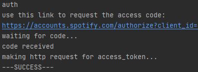
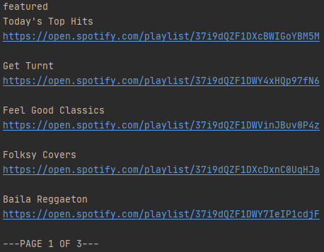
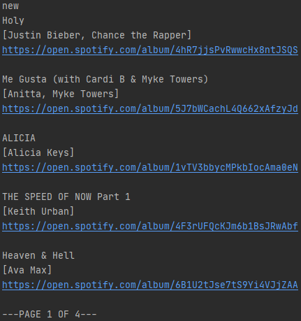
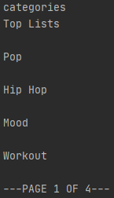
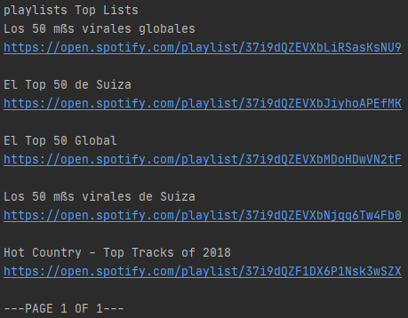
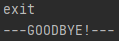

# MusicAdvisor
CLI app using Spotify API to create a personal music advisor that makes preference-based suggestions and even shares links to new releases and featured playlists.

## How to run
In root of the project:

    > gradle run -q --console=plain
    
    
## Parameters
`-access`

Authorization server path. If it isn't set, default server is https://accounts.spotify.com

`-resource`

API server path. If it isn't set, default server is https://api.spotify.com

`-page`

Number of entries that should be shown on a page. If it isn't set, default value is 5.

## Commands
`auth` Creates a link to confirm access of the app.

`featured` Gets a paginated list of Spotify-featured playlists with their links fetched from API.

`new` Gets a paginated list of new albums with artists and links on Spotify.

`categories` Gets a paginated list of all available categories on Spotify (just their names)

`playlists C_NAME` Gets a paginated list containing playlists of this category (where C_NAME is the name of category) and their links on Spotify.

`next` Goes to next page.

`prev` Goes to previous page.

`exit` Exits the program.

